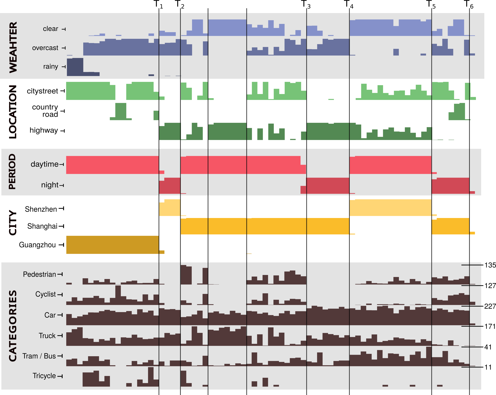
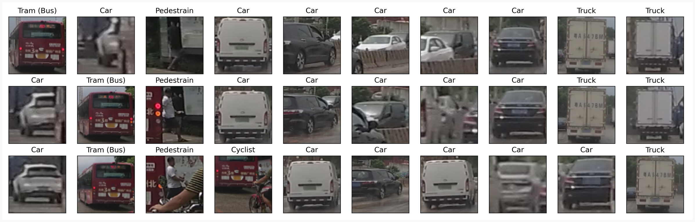
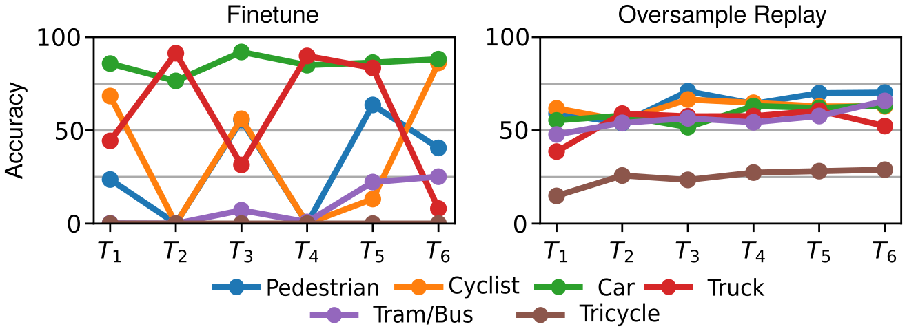
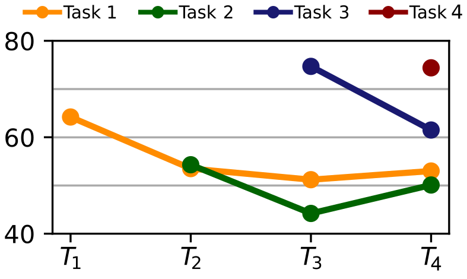

# &nbsp; CLAD

# A Continual Learning benchmark for Autonomous Driving

Welcome to the official repository for the CLAD benchmark. The goal of CLAD is to introduce a more realistic testing
bed for continual learning. We used [SODA10M](https://soda-2d.github.io/index.html), an industry scale dataset for
autonomous driving to create two benchmarks. CLAD-C is an online classification benchmark with natural, temporal 
correlated and continuous distribution shifts. CLAD-D is a domain incremental continual object detection benchmark.
Below are further details, examples and installation instructions for both benchmarks.

## Paper

A paper describing the benchmark in more detail, as well as a discussion on current Continual Learning benchmarks 
and the solutions proposed by the participants in the 2021 ICCV challenge with CLAD can be found 
[here](https://arxiv.org/abs/2210.03482).

If you use this benchmark, please cite:

```
@article{verwimp2022cl,
  title = {CLAD: A realistic Continual Learning benchmark for Autonomous Driving},
  author={Verwimp, Eli and Yang, Kuo and Parisot, Sarah and Lanqing, Hong and McDonagh, Steven and P{\'e}rez-Pellitero, Eduardo and De Lange, Matthias and Tuytelaars, Tinne},
  journal = {arXiv preprint arXiv:2210.03482},
  year = {2022}
}
```
## Installation

CLAD is provided as a python module and depends only on pytorch and torchvision. Optionally you can also use 
[Avalanche](https://avalanche.continualai.org/) and [Detectron2](https://github.com/facebookresearch/detectron2) to 
easily benchmark your own solutions. 

Clone this GitHub repo:
```bash
git clone git@github.com:VerwimpEli/CLAD.git
```
Add the installation directory to your python path. On Linux:
```bash
export PYTHONPATH=$PYTHONPATH:[clad_installation_folder]
```
_(Optional)_ Install the Avalanche master branch. Their pip-module doens't have all functionalities we use.
```bash
pip install git+https://github.com/ContinualAI/avalanche.git
```

_(Optional)_ Install Detectron2, follow the instructions
[here](https://detectron2.readthedocs.io/en/latest/tutorials/install.html) for your Pytorch and Cuda installations.

## CLAD-C

### Benchmark introduction

CLAD-C is a classification benchmark for continual learning  from a stream of chronologically ordered images. 
A chronological stream induces continous, yet realistic distribution 
shifts, both in the label distribution and the domain distributions. The image below gives an overview of the 
distribution changes throughout the stream. The x-axis displays the time, along which the images are given.
An example of a distribution shift happens between $T_1$ and $T_2$, which is during the night. If you look at the 
classes that are present during this period, you'll see that there's almost no pedestrians and cyclist left. A similar
thing happens during the other night, or when the car is on the highway. Also, the tricycle is most frequent in 
Guangzhou, not showing up much in the other cities. Beyond this, there are much more frequent but smaller 
distribution shifts not clearly visible in this plot.

<p align="center">
    
</p>

As an example, these are three subsequent batches if the batch size is set to 10. Note the domination of the cars and
the multiple appearances of the same images from slightly different angles.  

<p align="center">
    
</p>


### Evaluation
The goal of the challenge is to maximize $AMCA$, or Average Mean Class Accuracy. This is the mean accuracy over all 
classes, averaged at different points during the datastream. We chose this metric because of the high class imbalance 
in the datastream and such that each class is equally important. We calculate this mean accuracy at different points 
during the stream, since the continual learner should be resistent to distributions shifts which isn't tested if you 
only test at the end of the stream. Somewhat arbitrary, we chose the switches between day and night as testing points
(the $T_i$ in the plot above). This is because we noted that at these points naively trainig is most likely to have 
failed. Summarized, the metric we use in this challenge is:

$$
\begin{equation}
AMCA = \frac{1}{T} \sum_{t} \frac{1}{C} \sum_c a_{c, t}
\end{equation}
$$

where $T$ are number of testing points and $C$ is the number of classes.


### Original Challenge Rules

The original challenge at ICCV had some restrictions, which we believe are still worth considering now. Of course, if there's a good reason to deviate from them, there's no reason for not doing so now. Below are the original rules, order by our perceived importance at this point.

1. Maximal replay memory size is 1000 samples
2. The data should be trained as a stream, i.e. no repetetions of data that's not in the memory. 
3. Maximum batch size is 10
4. No computationally heavy operations are allowed between training and testing (i.e. ideally the model should almost
always be directly usable for predictions).
5. Maximum number of model parameters are 105% those of a typical Resnet50


### Minimal example
The method ```get_cladc_train``` returns a sequence of training sets (which is actually just one large stream of data), 
and should be trained once, in the returned 
order. After each set, the model should be tested. `get_cladc_val` or `get_cladc_test` returns a single validation 
or test set. For more elaborate examples, both with and without Avalanche, see [here](./examples). 

```python
import clad

import torch
import torchvision.models
from torch.nn import Linear
from torch.utils.data import DataLoader

model = torchvision.models.resnet18(weights=False)
model.fc = Linear(model.fc.in_features, 7, bias=True)

optimizer = torch.optim.SGD(model.parameters(), lr=0.01)

train_sets = clad.get_cladc_train('../../data')

val_set = clad.get_cladc_val('../../data')
val_loader = DataLoader(val_set, batch_size=10)
tester = clad.AMCAtester(val_loader, model)

for t, ts in enumerate(train_sets):
    print(f'Training task {t}')
    loader = DataLoader(ts, batch_size=10, shuffle=False)
    for data, target in loader:
        optimizer.zero_grad()
        output = model(data)
        loss = torch.nn.functional.cross_entropy(output, target)
        loss.backward()
        optimizer.step()

    print('testing....')
    tester.evaluate()
    tester.summarize(print_results=True)
```

### Results
The graph below shows the results of finetuning and training wiht a rehearsal memory while oversampling rare classes 
from that memory on the CLAD-C benchmark. The model used is a ResNet50, for more details, see the CLAD paper. 

<p align="center">
    
</p>

To be expected soon: some baseline models and the results of the ICCV '21 challenge on this benchmark. 

## CLAD-Detection

### Benchmark introduction

CLAD-D is a domain incremental continual object detection benchmark. Images from the SODA10M dataset are divided
into four tasks, which should be learned incrementally by a machine learning model, without accessing the past data.
The final performance of the model will be the average mAP over all tasks. The 4 tasks are defined as:

Task 1: clear weather - daytime - citystreet &nbsp; &nbsp;  (4470 - 497 - 2433) <br/>
Task 2: clear weather - daytime - **highway** &nbsp; &nbsp;  (1329 - 148 - 3126) <br/>
Task 3: **night** &nbsp; &nbsp;  (1480 - 165 - 2968) <br/>
Task 4: **rainy** - daytime &nbsp; &nbsp; (524 - 59 - 1442) <br/> 

Where the numbers between brackets indicate respectively the number of training, validation and test images per task.
Below are some examples images of each task, with the corresponding bounding box annotations. The domain gaps in this
benchmark are less harsh than those in domain-incrmental learning, yet still not trivial to overcome. 

<p align="center">
    
</p>

### Evaluation

CLAD-D is evaluated using the average mAP @IOU = 0.5, as in VOC Pascal. We then average this over all four tasks to give each task equal weight.

$$
\text{Average mAP} = \frac{1}{T} \sum_{t} \text{mAP}_t
$$

### Original Challenge Rules

The original challenge had some restirctions, some of which we believe are still worth considering. Of course, 
if there's a good reason to deviate from them, there's no reason for not doing so now. Below are the original rules, 
ordered by our perceived importance at this point.

1. Maximal rehearsal memory of 250 samples.
2. Only pretraining on Microsoft COCO and/or ImageNet1K.

### Minimal Example
To get the Avalanche-style benchmark, simply use the `get_cladd_avalanche` method, which will create an Avalanche
benchmark in the usual format. Then your strategy can be created using the `ObjectDetectionTemplate`, with optional 
training and testing plugins. 

```python
import clad

import logging
import torch
import torchvision

from torchvision.models.detection.faster_rcnn import FastRCNNPredictor
from avalanche.training.supervised.naive_object_detection import ObjectDetectionTemplate
from avalanche.evaluation.metrics import loss_metrics
from avalanche.evaluation.metrics.detection import DetectionMetrics
from avalanche.logging import InteractiveLogger
from avalanche.training.plugins import EvaluationPlugin

logging.basicConfig(level=logging.NOTSET)

# Get benchmark and models
benchmark = clad.get_cladd_avalanche(root='../../data')
model = torchvision.models.detection.fasterrcnn_resnet50_fpn(pretrained=True).to('cuda')

# Update model and create optimizer
in_features = model.roi_heads.box_predictor.cls_score.in_features
model.roi_heads.box_predictor = FastRCNNPredictor(in_features, 6+1)
optimizer = torch.optim.SGD(model.parameters(), lr=0.005, momentum=0.9, weight_decay=0.0005)

# Create Avalanche strategy
cl_strategy = ObjectDetectionTemplate(
    model=model,
    optimizer=optimizer,
    train_mb_size=5,
    train_epochs=1,
    eval_mb_size=5,
    device='cuda',
    evaluator=EvaluationPlugin(
        loss_metrics(epoch_running=True),
        DetectionMetrics(default_to_coco=True),
        loggers=[InteractiveLogger()],
    ),
)

# Train and test loop
for i, experience in enumerate(benchmark.train_stream):
    cl_strategy.train(experience, num_workers=4)
    cl_strategy.eval(benchmark.test_stream, num_workers=4)
```
To use Detectron2 to train CLAD-D, you only have to call `register_cladd_detectron`, which will register the CLAD-D
datasets names to the DatasetCatalog of Detectron2. Then you can just use the names of the datasets in your config 
files. Detectron2 doesn't support training multiple datasets sequentially, although you can probably write a script to 
fix that. 
```python
import clad

from detectron2.model_zoo import model_zoo
from detectron2.engine import DefaultTrainer, DefaultPredictor
from detectron2.config import get_cfg
from detectron2.evaluation import COCOEvaluator, inference_on_dataset
from detectron2.data import build_detection_test_loader

# This registers the CLAD-D datasets in Detectron2. They're accessible with the names cladd_T[i]_[split], with
# i the task-ID and [split] one of train/val/test.
clad.register_cladd_detectron(root='../../data')

cfg = get_cfg()

# Loads basic config file and then merges with our config file
cfg.merge_from_file(model_zoo.get_config_file("PascalVOC-Detection/faster_rcnn_R_50_C4.yaml"))
cfg.merge_from_file('./examples/cladd_detectron_ex.yaml')

trainer = DefaultTrainer(cfg)
trainer.resume_or_load()
trainer.train()

predictor = DefaultPredictor(cfg)

for test_dataset in cfg.DATASETS.TEST:
    evaluator = COCOEvaluator(test_dataset, output_dir=f"{cfg.OUTPUT_DIR}/{test_dataset}")
    val_loader = build_detection_test_loader(cfg, test_dataset)
    print(inference_on_dataset(predictor.model, val_loader, evaluator))
```
### Results
The graph below shows the per class fine-tune mAP's at IOU 0.5 when finetuning a Faster-RCNN model with a ResNet50 
backbone. While the model doesn't catastrophically forget, training on a different domain distribution does harm the 
performance on previous domains. For more details, see the CLAD paper. 

<p align="center">
    
</p>

To be expected: more baselines and the results of in the ICCV challenge.
