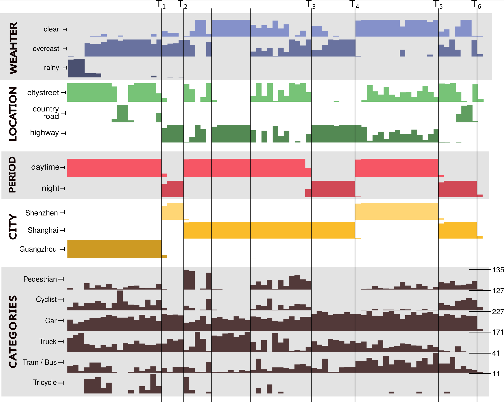

# &nbsp; CLAD

# A Continual Learning benchmark for Autonomous Driving

-------

Welcome to the official repository for the CLAD benchmark. The goal of CLAD is to introduce a more realistic testing
bed for continual learning. We used [SODA10M](https://soda-2d.github.io/index.html), an industry scale dataset for
autonomous driving to create two benchmarks. CLAD-C is an online classification benchmark with natural, temporal 
correlated and continuous distribution shifts. CLAD-D is a domain incremental continual object detection benchmark.
Below are further details, examples and installation instructions for both benchmarks.

## Installation

------

CLAD is provided as a python module and depends only on pytorch and torchvision. Optionally you can also use 
[Avalanche](https://avalanche.continualai.org/) and [Detectron2](https://github.com/facebookresearch/detectron2) to 
easily benchmark your own solutions. 

Clone this GitHub repo:
```bash
git clone git@github.com:VerwimpEli/CLAD.git
```
Add the installation directory to your python path. On Linux:
```bash
export PYTHONPATH=$PYTHONPATH:[clad_installation_folder]
```
_(Optional)_ Install the Avalanche master branch. Their pip-module doens't have all functionalities we use.
```bash
pip install git+https://github.com/ContinualAI/avalanche.git
```

_(Optional)_ Install Detectron2, follow the instructions
[here](https://detectron2.readthedocs.io/en/latest/tutorials/install.html) for your Pytorch and Cuda installations.

## CLAD-C

--------------------

CLAD-C is a classification benchmark for continual learning  from a stream of chronologically ordered images. 
A chronological stream induces continous, yet realistic distribution 
shifts, both in the label distribution and the domain distributions. The image below gives an overview of the 
distribution changes throughout the stream. The x-axis displays the time, along which the images are given.
An example of a distribution shift happens between $T_1$ and $T_2$, which is during the night. If you look at the 
classes that are present during this period, you'll see that there's almost no pedestrians and cyclist left. A similar
thing happens during the other night, or when the car is on the highway. Also, the tricycle is most frequent in 
Guangzhou, not showing up much in the other cities. Beyond this, there are much more frequent but smaller 
distribution shifts not clearly visible in this plot.

<p align="center">
    
</p>

The goal of the challenge is to maximize $AMCA$, or Average Mean Class Accuracy. This is the mean accuracy over all classes, averaged at different points during the datastream. We chose this metric because of the high class imbalance in the datastream and such that each class is equally important. We calculate this mean accuracy at different points during the stream, since the continual learner should be resistent to distributions shifts which isn't tested if you only test at the end of the stream. Somewhat arbitrary, we chose the switches between day and night as testing points (the $T_i$ in the plot above). This is because we noted that at these points naively trainig is most likely to have failed. Summarized, the metric we use in this challenge is:
$$
AMCA = \frac{1}{T} \sum_{t} \frac{1}{C} \sum_c a_{c, t}
$$
where $T$ are number of testing points and $C$ is the number of classes.


The bechmark works both with and without `avalanche`, so use whatever you want. The `examples` folder contains both
an example without (`classification.py`) and one with Avalanche (`classification_avalanche.py`). Feel free to test both.

The benchmark is based on the SODA10M dataset, see [here](https://soda-2d.github.io/index.html). We only use the 
labelled data, so only the labelled data should be downloaded. The original data doesn't include the necessary
time stamps, but these will be downloaded automatically the first time. 

### Steps to run the examples

1. Download the labeled trainval and test data [here](https://soda-2d.github.io/download.html).
The unlabeled data isn't used in this benchmark. Extract both to your `data_root` folder, keeping all
other file and directory names the same. 
2. Prepare the required libraries, but except the `PyTorch` libraries, no additional ones are required. 
Code is tested with Python `3.9` and the latest `pytorch` and `torchvision` libraries. 
You can also use the provided `env.yml` file and make a conda environment with: `conda env create -f env.yml`
3. Make sure that the `clad` library is added to your `PYTHONPATH`. On linux: 
`export PYTHONPATH=$PYTHONPATH:[path_to_clad]`
4. (Optional) Install `Avalanche` from their master branch (the default pip library lacks some required
features): `pip install git+https://github.com/ContinualAI/avalanche.git`. 
5. Test the `classification.py` or `classification_avalanche.py` examples.

Finally, you can check [this notebook](./examples/data_intro_c.ipynb) for further details on the benchmark,
its creation and how it is evaluated. 

## CLAD-Detection

